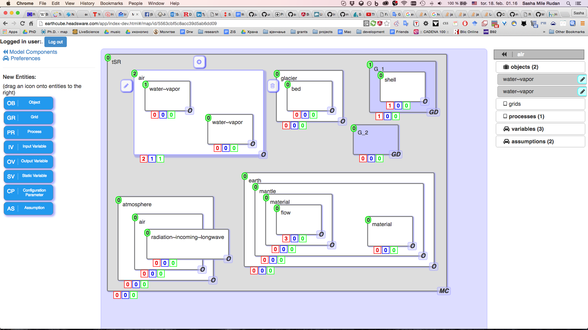

# MCM - McModelar

An interactive Modeler for American NSF (National Science Foundation) project EarthCube

# Technology

+ MEAN
+ [KnAllEdge](https://www.KnAllEdge.org)
+ [CollaboScience](https://www.CollaboScience.com)
+ [D3.js](https://d3js.org)
+ [Interact.js](http://interactjs.io)

# Example

